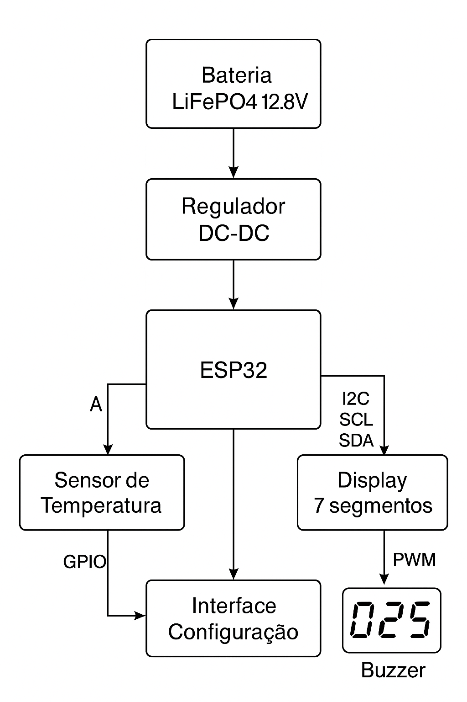

# 📡 Monitor de Temperatura com ESP32, Alarme e Display 7-Segmentos

Este projeto implementa um **sistema embarcado de monitoramento de temperatura ambiente** utilizando o microcontrolador **ESP32**, com **alarme sonoro** e exibição em **display de 7 segmentos**.  

A arquitetura foi representada em **diagrama de blocos** conforme especificado na Atividade 01.

---

## 🎯 Objetivo
Projetar e representar a arquitetura de hardware de um sistema embarcado capaz de:
- Medir a temperatura ambiente (0 °C a 100 °C).
- Exibir a temperatura em um display de 3 dígitos (7 segmentos).
- Acionar um alarme sonoro (buzzer) quando a temperatura ultrapassar um limite configurável.
- Permitir ajuste do limite de alarme por meio de uma interface simples (botão/encoder).
- Operar com alimentação de **bateria LiFePO4 4S (~12,8 V nominal)**.

---

## 🛠️ Componentes Principais
- **Microcontrolador:** ESP32 (leitura do sensor, lógica de controle, acionamento de periféricos).
- **Sensor de Temperatura:** LM35 (saída analógica 10 mV/°C).
- **Display 7 Segmentos (3 dígitos):** Controlado via driver (I2C/SPI) ou multiplexado.
- **Buzzer Piezoativo:** Acionado via GPIO/PWM do ESP32.
- **Interface de Configuração:** Botão ou encoder rotativo (GPIO/I2C).
- **Fonte de Alimentação:** Bateria LiFePO4 4S + regulador DC-DC (12,8 V → 5 V / 3,3 V).

---

## 🔌 Diagrama em Blocos

**Sinais principais:**
- `ADCx` → Entrada analógica do sensor LM35 para o ESP32.  
- `I2C (SCL/SDA)` → Comunicação com driver do display 7 segmentos.  
- `PWM/GPIO` → Controle do buzzer pelo ESP32.  
- `GPIO` → Interface de configuração do limite (botão/encoder).  

---

## 📂 Estrutura do Repositório

